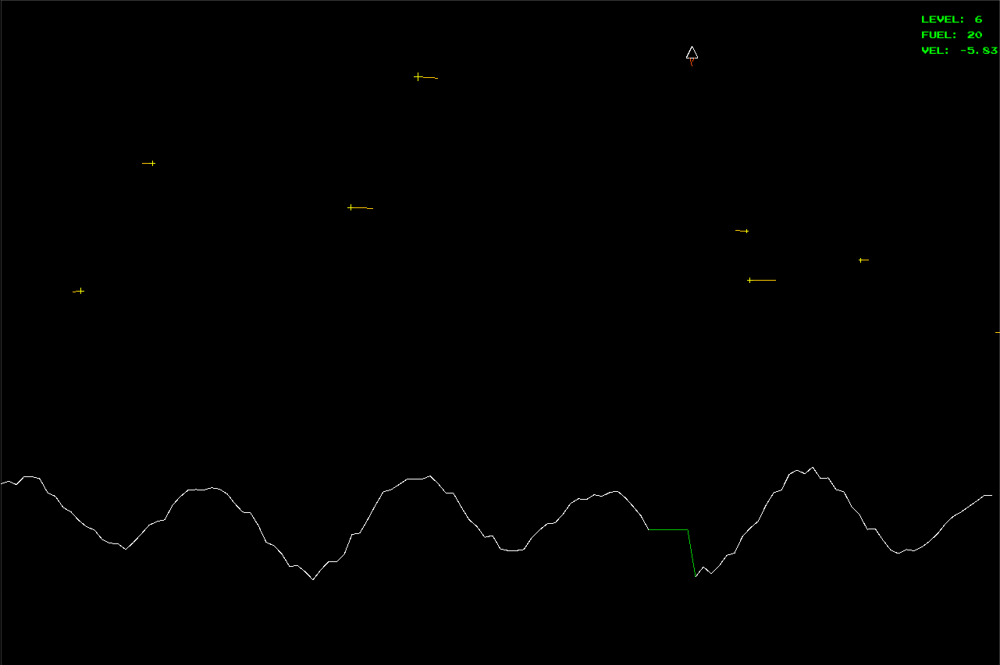

# Vibe lander
`js`

`go`

A `javascript` / `html` of the 1979 Atari game [Lunar Lander](https://en.wikipedia.org/wiki/Lunar_Lander_%281979_video_game%29) 

And a `go` version as well!

😎 Completely vibe coded! 🔥

# How to run

You can run this game by opening the [index.html](./index.html) in your browser or you can run a simple http server in the root folder of this repo e.g. (in python) `python -m http.server`

`go install github.com/bramca/Vibe-Lander/cmd/vibelander@latest` 
`vibelander`

# Controls
`arrow up` hold to thrust upward. 
`arrow left/right` hold to thrust the ship left or right. 
`r` when you crash, press this key to restart the game. 
`n` when you land, press this key to move to the next level.
